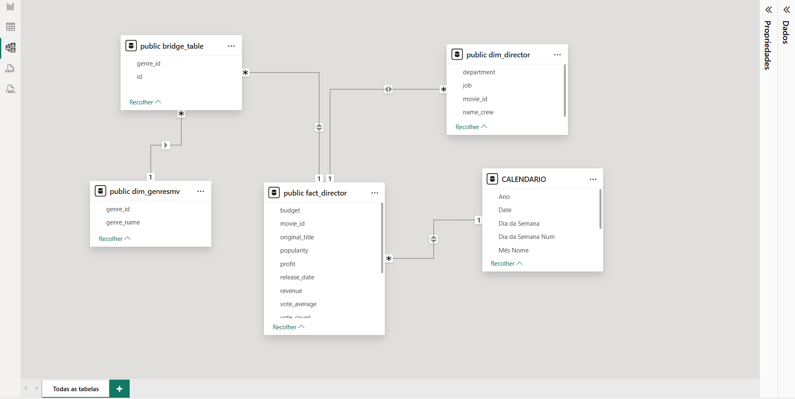

# 🎬 Análise da Indústria Cinematográfica
Dashboard interativo de Análise de ROI, Lucro e fatores de sucesso no cinema.

## 🎯 Objetivo
Analisar os principais fatores que influenciam o sucesso de um filme utilizando dados do TMDB.

---

## 🛠️ Ferramentas utilizadas
- PostgreSQL (SQL)
- Power BI
- Dataset: TMDB 5000 Movies (Kaggle)

---

## 📊 Dashboard

---

## 🧠 Modelagem de Dados

---

## 📌 Etapas do Projeto

### 1. Importação dos dados
Os dados foram importados no PostgreSQL com todas as colunas como TEXT.

### 2. Tratamento dos dados
Foram criadas views para tratar JSON e organizar os dados.

### 3. Modelagem
Construção de um modelo estrela (Star Schema).

### 4. Dashboard
Criação de visualizações no Power BI.

---

## 📈 Principais Insights

- Existe relação entre orçamento e bilheteria
- Filmes com maior investimento tendem a maior receita
- Gênero influencia na avaliação

---

## 🧠 Conclusão

O sucesso de um filme depende de múltiplos fatores como investimento, gênero e popularidade.
