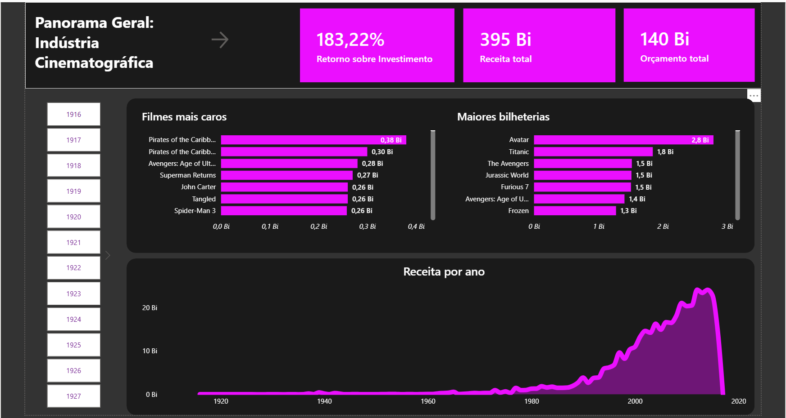
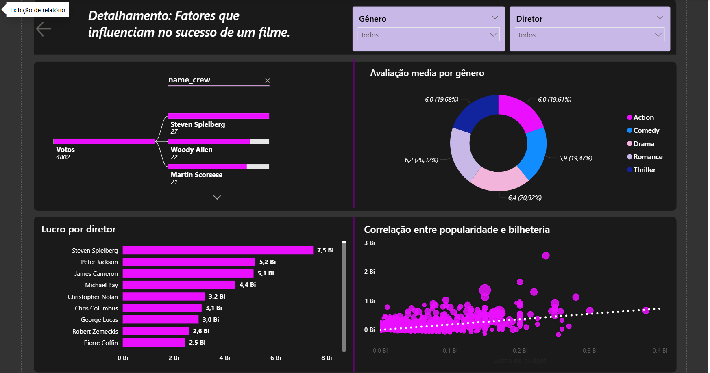

# Análise da Indústria Cinematográfica
Dashboard interativo de Análise de ROI, Lucro e fatores de sucesso no cinema.

## Objetivo
Analisar os principais fatores que influenciam o sucesso de um filme utilizando dados do TMDB.

---

## Ferramentas utilizadas
- PostgreSQL (SQL)
- Power BI
- Dataset: TMDB 5000 Movies (Kaggle)

---

## Dashboard- Powwer BI

---

## Modelagem de Dados

---

## Etapas do Projeto

### 1. Importação dos dados
Os dados foram importados no PostgreSQL com todas as colunas como TEXT.

### 2. Tratamento dos dados- SQL
Foram criadas views para tratar JSON e organizar os dados.
Remocao de dados duplicados
Transformação dos dados de origem
Criação de VIEWS para facilitar a construção do modelo de dados.

### 3. Modelagem
Construção de um modelo estrela (Star Schema) utilizando tabelas dimensão e fato.

### 4. Dashboard
Criação de visualizações no Power BI.
Criação de medidas e indicadores como Lucro, ROI e Receita.

---

## 📈 Principais Insights

-A análise dos dados revela que o lucro na indústria cinematográfica é multifatorial: 
Gêneros como drama e comédia lideram em satisfação, mas não necessariamente em volume financeiro.
-Existe uma correlação direta entre o orçamento total de um filme a sua bilheteria, indicando que investimentos em produção visual e cenários bem elaborados contribuem para o alcance de bilheterias bilionárias.

---
##   Conclusão

O sucesso de um filme é o equilíbrio entre narrativas emocionantes e a capacidade técnica de criar experiências imersivas para o telespectador.

